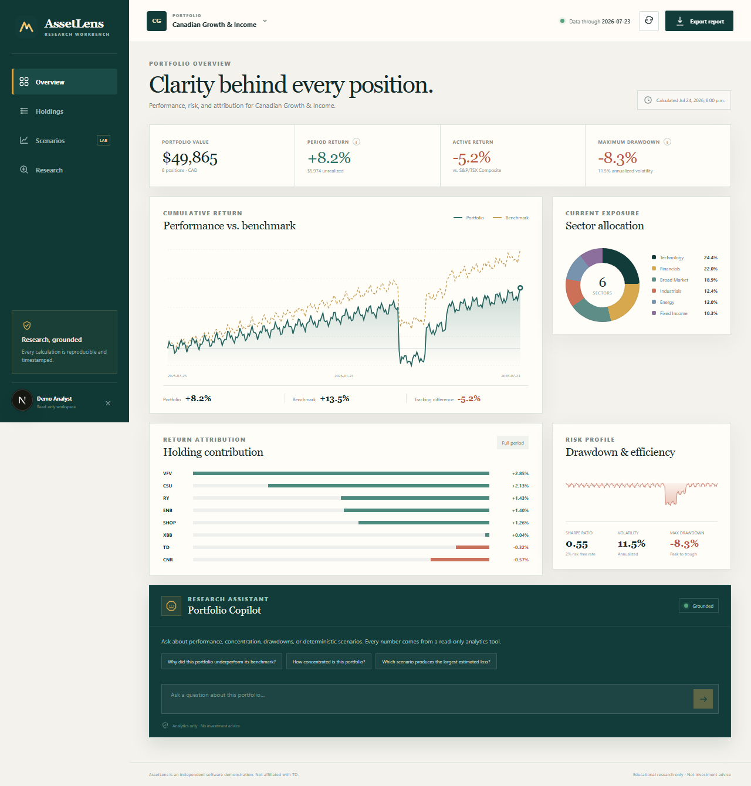

# AssetLens

AssetLens is a portfolio research and analytics workbench built as an independent
demonstration project. It is not affiliated with TD and does not reproduce any
private TD system.

The app ships with a seeded Canadian multi-asset portfolio so the complete
experience works immediately: benchmark comparison, risk metrics, exposure,
performance attribution, deterministic stress scenarios, a grounded research
copilot, CSV import, and timestamped PDF reports.



## Live demo

Open [assetlens-web.onrender.com](https://assetlens-web.onrender.com) and choose
**Enter demo workspace**. The deployment uses free Render web services and a
free Neon PostgreSQL database, so the first request after inactivity can take a
moment to wake up.

## Verified outcomes

- Prevented partial portfolio updates during CSV ingestion: a file containing
  an invalid row left holdings unchanged, while an identical valid-file replay
  was recognized without processing the import twice.
- Validated portfolio analytics across 260 deterministic business-day
  observations, with sector exposure weights reconciling to 100% and drawdown
  calculations tracking the running peak.
- Grounded all 3 tested research questions in the correct read-only analytics
  tools with citations, and refused all 3 tested buy/sell/price-target prompts
  before making any tool call.
- Rework verification: 56 API tests passed with 85% statement coverage across
  940 Python statements; 8 frontend tests, standalone TypeScript checking, the
  production build, and 2 isolated Chromium journeys passed. Browser coverage
  includes empty-portfolio creation, CSV import, and a saved PDF report.

No throughput, latency, or deployment-time improvement is claimed because the
repository does not contain a recorded load test or manual deployment baseline.

## Quick start

### Local development

Prerequisites: Node.js 24 (used in CI and current local verification), Python
3.12+, and npm.

```powershell
cd apps/api
python -m venv .venv
.\.venv\Scripts\Activate.ps1
pip install -e ".[dev]"
uvicorn app.main:app --reload
```

In a second terminal:

```powershell
cd apps/web
npm install
npm run dev
```

Open <http://localhost:3000> and choose **Enter demo workspace**. The frontend
proxies `/api` requests to FastAPI at `http://localhost:8000`.

### Docker Compose

```powershell
docker compose up --build
```

This starts the web app, API, PostgreSQL, Redis, and a Celery worker.

## Demo flow

1. Enter the demo workspace.
2. Review the seeded Canadian Growth & Income portfolio.
3. Compare its return and drawdown with the S&P/TSX Composite proxy.
4. Inspect sector allocation and holding-level contributors.
5. Run the **Technology drawdown** scenario.
6. Ask, “Why did this portfolio underperform its benchmark?”
7. Export the timestamped research report.

## CSV format

Imports are atomic: a file with any invalid row changes nothing. Required
columns are `ticker`, `quantity`, and `average_cost`.

```csv
ticker,name,quantity,average_cost,current_price,sector,asset_class,geography,currency
RY,Royal Bank of Canada,25,128.40,151.20,Financials,Equity,Canada,CAD
XBB,iShares Core Canadian Universe Bond ETF,40,29.10,28.65,Fixed Income,Fixed Income,Canada,CAD
```

## Copilot safety model

- All model-accessible tools are authenticated and read-only.
- Financial metrics are calculated by the analytics engine, never by the LLM.
- Answers include tool-call records, source identifiers, and data timestamps.
- Personalized buy/sell/hold questions are refused.
- Retrieved or tool-provided text is treated as data, not as instructions.
- The live OpenAI path is optional. With `OPENAI_API_KEY` configured,
  `COPILOT_PROVIDER=auto` uses the Responses API and `gpt-5.6-sol`; otherwise a
  deterministic grounded explanation keeps the demonstration fully usable.

## Repository map

```text
apps/api/     FastAPI, SQLAlchemy, analytics, scenarios, copilot, reports
apps/web/     Next.js, React, TypeScript dashboard
tests/e2e/    Playwright smoke journey
infra/        Kubernetes and Kustomize manifests
docs/         Architecture, security, and metric methodology
```

## Verification matrix

The outcomes below are tied to automated checks or a recorded benchmark on the
current revision. They are not production measurements, and no percentage
improvement is claimed without a before-and-after baseline.

| Verified outcome | Automated evidence | Current result |
| --- | --- | --- |
| Prevented partial portfolio writes from invalid CSV imports and duplicate effects from exact import replays. | `test_csv_import_is_atomic_and_idempotent` | Invalid input left the portfolio unchanged; replaying identical valid bytes returned an idempotent result. |
| Prevented cross-user access to portfolio analytics, mutations, scenario results, and reports. | `test_authorization.py` plus service-layer owner checks | 11 protected cross-owner read/workflow attempts returned `404`; portfolio lists remained owner-scoped. |
| Grounded copilot answers in read-only analytics tools and refused personalized trading advice. | Six parameterized cases in `test_copilot.py` | Three research prompts produced tool records and citations; three buy/sell/price-target prompts were refused before tool use. |
| Produced deterministic scenario results and downloadable research reports. | `test_scenario_job_returns_grounded_impact` and `test_report_is_a_real_pdf` | Scenario completed with three explicit assumptions; report output was a valid PDF larger than 2 KB. |
| Exercised seeded analytics/scenarios and the creation/import/report workflow. | React Testing Library and `tests/e2e/demo.spec.ts` | 8 frontend tests and 2 isolated Chromium journeys passed; downloaded report bytes have a PDF signature and exceed 2 KB. |
| Replaced ad hoc repository checks with a repeatable CI workflow. | Four GitHub Actions jobs in `.github/workflows/ci.yml` | Automates API lint/tests/migrations, frontend audit/tests/build, two container builds, and the browser journey. |
| Established an absolute performance baseline without inventing an improvement percentage. | `scripts/benchmark_api.py` and `docs/performance.md` | 410 measured sequential local requests completed without HTTP errors; recorded p95 latency ranged from 70.527 ms to 158.745 ms by operation. |

Current rework verification: **56 API tests passed with 85% statement coverage**,
8 frontend tests and standalone type checking passed, the optimized Next.js build
completed, and 2 Chromium journeys passed. Isolated SQLite migration upgrade and
schema-drift checks passed. These are local Windows/Python 3.12.10/Node 24.19.0
results. [CI for `38fca0b`](https://github.com/MarvelousJade/AssetLens/actions/runs/37703251502)
also passed all four jobs on `ubuntu-latest`, including the full frontend audit,
browser journeys, and both container image builds. Image builds do not verify
running container integrations; PostgreSQL, Celery workers, external providers,
and production deployment remain unverified.

See [the interview guide](docs/interview-guide.md) for a short study path,
[the engineering journal](docs/engineering-journal.md) for reproduction and actual
verification evidence, and [the rework plan](docs/rework-plan.md) for scope. Start the preserved debugging
checkpoints with [learner instructions](docs/debugging-exercises.md); diagnoses
and solutions are kept in a separate spoiler document. Both exercises are fixed
in the final working state and integrated with a non-squashed merge.

## Quality commands

```powershell
cd apps/api
python -m pytest
python -m ruff check app tests scripts

cd ..\web
npm audit
npm test
npx tsc --noEmit
npm run build

cd ..\..
npm run test:e2e
```

Browser tests use dedicated ports 8876/3101, their own ignored SQLite database,
and ignored `test-results/` artifact paths. They refuse existing servers rather
than borrowing unknown local state. The API interpreter prefers `apps/api/.venv`
when present; set `API_PYTHON` to choose a different interpreter. No screenshots
under `docs/screenshots/` or user runtime database are overwritten.

The demo token is public and the workspace allows fictional portfolio imports
and other demo writes. Do not upload personal or sensitive financial data.

## Performance baseline

Run the local API benchmark from `apps/api`:

```powershell
python scripts/benchmark_api.py --iterations 100 --report-iterations 10
```

The benchmark uses a temporary SQLite database, FastAPI's in-process test
client, and the deterministic copilot. See [docs/performance.md](docs/performance.md)
for the recorded baseline, methodology, and limits. These measurements are not
production results or verified performance improvements.

## Disclaimer

AssetLens is for software demonstration and educational research only. Scenario
results are simplified estimates, not forecasts. Nothing in the application is
investment advice or a recommendation to buy, sell, or hold a security.
