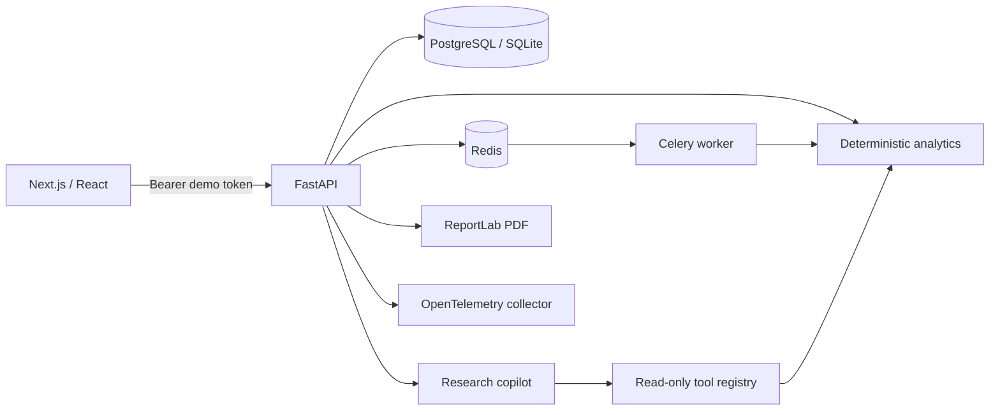

# Architecture

AssetLens is a modular monolith with a separately deployable web application,
API, and task worker. The boundary keeps the portfolio-grade demonstration
understandable while preserving the same contracts needed to scale individual
workloads.

## Runtime boundaries

- **Web:** Next.js renders the workspace and proxies same-origin `/api` traffic,
  avoiding browser CORS and cookie-domain surprises.
- **API:** FastAPI authenticates first, applies portfolio ownership on every
  resource query, and exposes stable REST contracts.
- **Analytics:** pure service functions calculate holdings, returns, risk,
  attribution, exposure, and scenario impacts from stored values.
- **Jobs:** scenarios use an in-process background runner for zero-setup local
  development and Celery/Redis in the Compose and Kubernetes environments.
- **Copilot:** the default deterministic explainer and optional OpenAI Responses
  API path share the same read-only tool registry and citation records.
- **Storage:** SQLAlchemy supports SQLite for a reviewer demo and PostgreSQL for
  deployed environments. Alembic owns schema versions.

## Data lifecycle

1. Immutable import bytes are hashed and checked for idempotency.
2. Every row is parsed and validated before a transaction writes any holding.
3. Market prices remain date-stamped observations.
4. Analytics are calculated from holdings and prices and return an `as_of`,
   `calculated_at`, formula, and period.
5. Scenario runs persist their input definition, status, output, and assumptions.
6. Copilot tool calls and report creation write audit events.

## Reliability choices

- Scenario jobs are status-addressable and safe to poll, cancel, or retry.
- Import hashes prevent accidental duplicate ingestion.
- Database connection pools use pre-ping.
- Health checks include a live database query and data-freshness timestamp.
- Each request returns `x-request-id` and `server-timing`; an OTLP endpoint
  enables FastAPI and SQLAlchemy traces without changing application code.
